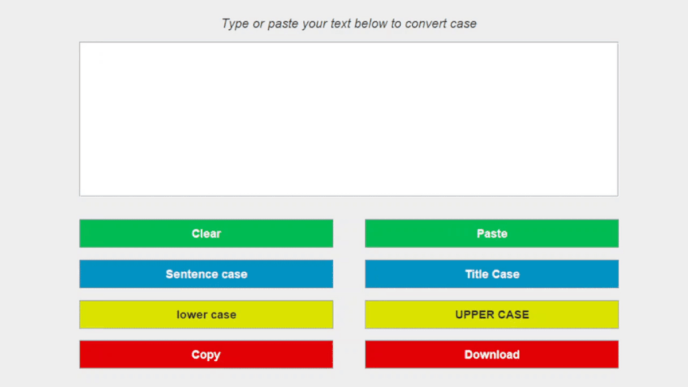

# Case Converter
Case Converter is a compact application that was typed in Java. It is used for changing the size of letters in given text.

## Overview
 

After running the application, you can see an empty **text area** and **eight buttons**.
Now, you can paste or type a text and change the size of letters using **blue** and **yellow buttons**.
You can choose from the following cases: **sentence case** (the option that capitalises the first letter of each sentence), **title case** (the option that capitalises the first letter of each word), **lower case** (the option that converts all the letters into small letters) and **upper case** (the option that converts all the letters into capital letters).
Additionally, you can clear the text area by clicking on the **Clear button**, paste text from or copy to the clipboard (using the **Paste button** or the **Copy button**) and download your text as .txt file (using the **Download button**).

## How to launch app
* Install Java Runtime Environment (version 15)
* Download and run [JAR file](https://github.com/agunia2000/CaseConverter/raw/master/gitresources/Case%20Converter.jar)
